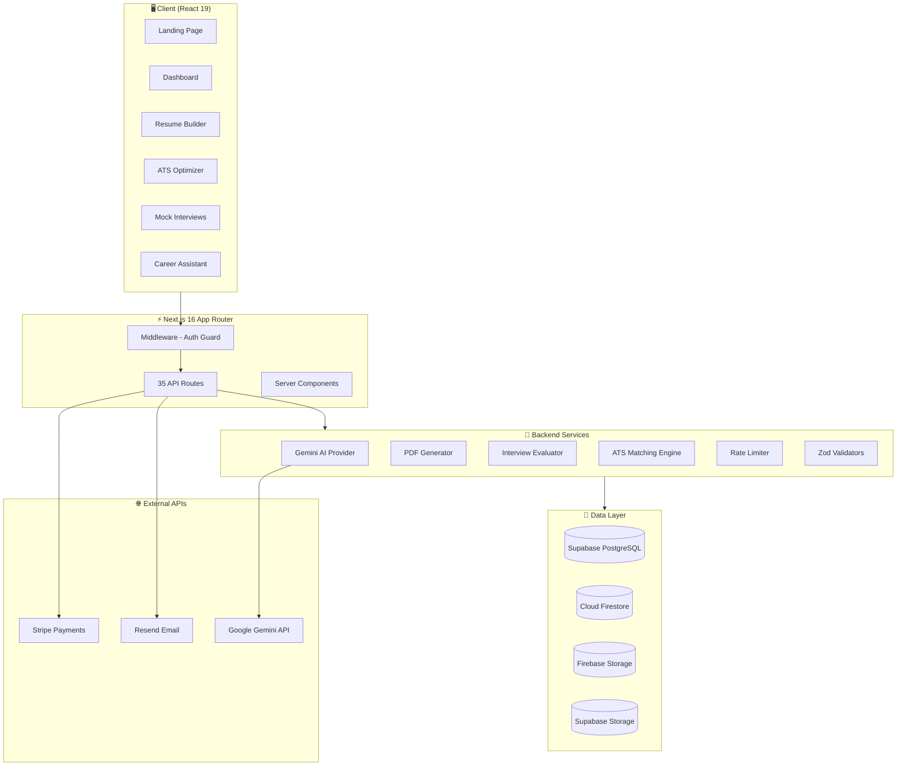
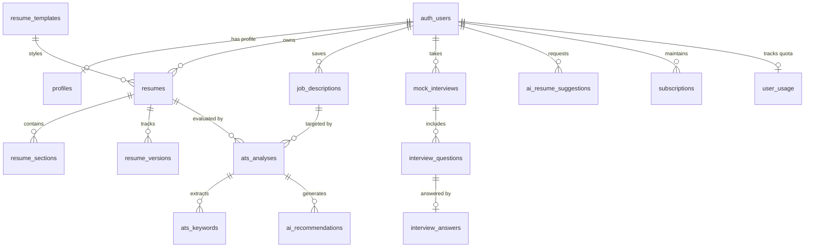

<div align="center">

# 🚀 ResumeAI — AI-Powered Resume Builder & Career Platform

**Build ATS-optimized resumes, ace mock interviews, and land your dream job — all powered by AI.**

[](https://nextjs.org/)
[](https://react.dev/)
[](https://www.typescriptlang.org/)
[](https://tailwindcss.com/)
[](https://supabase.com/)
[](https://firebase.google.com/)
[](https://ai.google.dev/)
[](LICENSE)

[Live Demo](https://resume-app-ten-nu.vercel.app) · [Report Bug](https://github.com/theakashr/Ai-Resume-Builder/issues) · [Request Feature](https://github.com/theakashr/Ai-Resume-Builder/issues)

</div>

---

## 📋 Table of Contents

- [Overview](#-overview)
- [Key Features](#-key-features)
- [Tech Stack](#-tech-stack)
- [Architecture](#-architecture)
- [Getting Started](#-getting-started)
- [Database Schema](#-database-schema)
- [API Reference](#-api-reference)
- [Security](#-security)
- [Testing](#-testing)
- [Project Structure](#-project-structure)
- [Contributing](#-contributing)
- [License](#-license)

---

## 🌟 Overview

**ResumeAI** is a full-stack career platform that combines AI-powered resume building, ATS optimization, mock interview simulation, and career coaching into a single application. Built with Next.js 16, React 19, and Google Gemini AI, it helps job seekers create professional, ATS-friendly resumes and prepare for interviews with real-time AI feedback.

### Why ResumeAI?

- 🎯 **ATS-Optimized** — Score your resume against real job descriptions with a 5-dimensional analysis engine
- 🤖 **AI-Powered** — Google Gemini rewrites bullets, generates summaries, and provides career coaching
- 🎤 **Mock Interviews** — Practice with 30+ AI-generated questions, get STAR-framework scoring and speech analytics
- 📄 **Instant PDF Export** — Zero-dependency, pure-TypeScript vector PDF generation (no headless browsers)
- 🔒 **Enterprise Security** — 100% Row-Level Security, rate limiting, prompt injection guardrails, and PII-safe logging

---

## ✨ Key Features

### 📝 Interactive Resume Builder
- **Live paper preview** with 4 design themes: Modern, Executive, Minimalist, Creative
- **Modular section editor** for Personal Details, Summary, Experience, Skills, Education, Projects, and Certifications
- **Drag-to-reorder** sections to customize your resume layout
- **Inline AI Assistant** that rewrites bullets with action verbs, quantifiable metrics, and active voice
- **Auto-save** with cloud sync and version history (snapshot & restore)
- **1-click PDF download** via a pure-TypeScript vector PDF engine

### 📊 ATS Resume Optimizer
- Paste any job description and get a **5-dimensional ATS score** (0–100%):
  - Overall Match · Keyword Score · Skills Match · Experience Alignment · Formatting Score
- **Keyword gap analysis** — Matched, Missing, and Recommended keywords with priority ratings
- **1-click "Add to Resume"** for missing keywords
- Actionable AI recommendations for headers, bullet metrics, and missing qualifications

### 🎤 AI Mock Interview Simulator
- Configure **role**, **experience level** (Entry → Executive), **interview type** (Technical, Behavioral, HR, Mixed), and **difficulty**
- **Audio/video pre-flight check** with live camera preview and volume meter
- **30+ personalized questions** across 7 categories: Introduction, Resume & Projects, Technical, Behavioral, Situational, Job-Specific, HR/Career
- **Real-time speech analytics**: Words Per Minute, filler word count, pause tracking
- **STAR framework scoring**: Evaluates Situation, Task, Action, and Result in every answer
- **Multi-metric grading**: Technical (35%), Communication (25%), Relevance (25%), STAR (15%)
- Detailed per-question breakdown with strengths, improvements, and model answers

### 💬 AI Career Assistant
- Conversational chat interface for career guidance
- Preset actions: "Optimize bullet points", "Find missing ATS keywords", "Generate interview questions"
- Prompt injection guardrails prevent fabricated experience or credentials

### 📋 Resume Templates
| Template | Best For |
|---|---|
| **Executive Clean** | Senior management & leadership roles |
| **Tech Specialist** | Engineering roles with GitHub links & project metrics |
| **Minimalist Mono** | Clean, modern layouts with generous whitespace |
| **Modern Tech** | Vibrant accent highlights with competence tags |
| **Creative Bold** | Marketing, strategy, and design roles |
| **ATS Universal** | 100% Workday, Greenhouse, and Taleo compliant |

### 💳 Subscription Tiers

| Feature | Free | Pro | Enterprise |
|---|:---:|:---:|:---:|
| Resumes | 2 | 15 | 100 |
| ATS Scans / month | 3 | 50 | 500 |
| AI Generations / month | 5 | 100 | 1,000 |
| Mock Interviews / month | 1 | 20 | 100 |

---

## 🛠 Tech Stack

| Layer | Technology |
|---|---|
| **Framework** | Next.js 16.2 (App Router, Server Components, Turbopack) |
| **UI** | React 19.2, Tailwind CSS 4, lucide-react icons |
| **Language** | TypeScript 5.x (strict mode) |
| **Database** | Supabase (PostgreSQL 15+) with 100% Row-Level Security |
| **Auth** | Firebase Auth (Google OAuth, Email/Password, Magic Link) + Supabase SSR Auth |
| **AI Engine** | Google Gemini 1.5 Flash via REST API (zero SDK overhead) |
| **Validation** | Zod 4.4 for all request/response schemas |
| **PDF Export** | Custom pure-TypeScript vector PDF 1.4 generator |
| **Payments** | Stripe (Checkout, Billing Portal, Webhooks) |
| **Email** | Resend API + SMTP fallback |
| **Real-time DB** | Cloud Firestore (client-side documents) |
| **File Storage** | Firebase Storage + Supabase Storage |
| **Linting** | ESLint 9 with eslint-config-next |

---

## 🏗 Architecture



---

## 🚀 Getting Started

### Prerequisites

- **Node.js** 18+ and **npm** 9+
- A [Supabase](https://supabase.com) project
- A [Firebase](https://console.firebase.google.com) project
- A [Google AI Studio](https://aistudio.google.com) API key (for Gemini)
- *(Optional)* [Stripe](https://stripe.com) account for billing features

### Installation

```bash
# 1. Clone the repository
git clone https://github.com/theakashr/Ai-Resume-Builder.git
cd Ai-Resume-Builder/resume-app

# 2. Install dependencies
npm install

# 3. Set up environment variables (optional for local dev)
cp .env.example .env.local

# 4. Run Supabase migrations (if using Supabase CLI)
npx supabase db push

# 5. Start the development server
npm run dev
```

Open [http://localhost:3000](http://localhost:3000) in your browser.

### Available Scripts

| Command | Description |
|---|---|
| `npm run dev` | Start dev server with Turbopack on port 3000 |
| `npm run build` | Create production build |
| `npm run start` | Start production server |
| `npm run lint` | Run ESLint checks |
| `npx tsx tests/run_master_suite.ts` | Run all 76 API tests |

---

## 🗄 Database Schema

The application uses **PostgreSQL 15+** on Supabase with **14 application tables**, all protected by Row-Level Security.



### Key Tables

| Table | Purpose |
|---|---|
| `profiles` | User profile (1:1 with auth, auto-created via trigger) |
| `resumes` | Resume records with title, template, status, ATS score |
| `resume_sections` | Modular sections with JSONB content and ordering |
| `resume_versions` | Immutable snapshots for version history & restore |
| `resume_templates` | Global template catalog (read-only for users) |
| `job_descriptions` | Saved target job postings |
| `ats_analyses` | ATS evaluation results with 5 sub-scores |
| `ats_keywords` | Matched, missing, and recommended keywords |
| `ai_recommendations` | Actionable AI feedback items |
| `ai_resume_suggestions` | AI-generated rewrites (generated → accepted/rejected) |
| `mock_interviews` | Interview sessions with config and overall score |
| `interview_questions` | Generated questions per session |
| `interview_answers` | Answers with multi-dimensional scores and feedback |
| `subscriptions` | Stripe subscription state and billing periods |
| `user_usage` | Monthly quota counters per feature |

### Migrations

All migrations are located in `supabase/migrations/` and are numbered sequentially:

```
20260801000001_database_foundation.sql      # Extensions & trigger functions
20260801000002_user_profiles.sql            # Profiles table & auth trigger
20260801000003_resume_builder.sql           # Resumes, sections, versions
20260801000004_resume_templates.sql         # Template catalog & seed data
20260801000005_job_descriptions.sql         # Job descriptions table
20260801000006_ats_analysis.sql             # ATS analysis tables
20260801000007_ai_assistant.sql             # AI suggestions table
20260801000008_mock_interviews.sql          # Interview tables
20260801000009_subscriptions.sql            # Billing & usage tables
20260801000010_storage.sql                  # Storage bucket policies
20260801000011_security_hardening.sql       # Grant revocations & audit view
20260801000012_testing.sql                  # Health verification function
```

---

## 📡 API Reference

The application exposes **35+ REST API endpoints** organized by domain:

### Authentication & Profile
| Method | Endpoint | Description |
|---|---|---|
| `GET` | `/api/auth` | Check active session |
| `POST` | `/api/auth/exists` | Check if email is registered |
| `POST` | `/api/auth/welcome-email` | Trigger welcome email |
| `GET` | `/auth/callback` | OAuth code exchange |
| `GET` | `/api/profile` | Get current user profile |

### Resumes
| Method | Endpoint | Description |
|---|---|---|
| `GET` | `/api/resumes` | List resumes (paginated, searchable) |
| `POST` | `/api/resumes` | Create new resume |
| `GET` | `/api/resumes/[id]` | Get resume by ID |
| `PATCH` | `/api/resumes/[id]` | Update resume |
| `DELETE` | `/api/resumes/[id]` | Delete resume |
| `GET` | `/api/resumes/[id]/sections` | List resume sections |
| `POST` | `/api/resumes/[id]/sections` | Add section |
| `PATCH` | `/api/resumes/[id]/sections/[sectionId]` | Update section |
| `DELETE` | `/api/resumes/[id]/sections/[sectionId]` | Delete section |
| `POST` | `/api/resumes/[id]/sections/reorder` | Reorder sections |
| `GET` | `/api/resumes/[id]/versions` | List version snapshots |
| `POST` | `/api/resumes/[id]/versions` | Create version snapshot |
| `GET` | `/api/resumes/[id]/versions/[versionId]` | Get specific version |
| `POST` | `/api/resumes/[id]/export` | Export as PDF |

### Templates
| Method | Endpoint | Description |
|---|---|---|
| `GET` | `/api/templates` | List all templates |
| `GET` | `/api/templates/[id]` | Get template details |

### Job Descriptions
| Method | Endpoint | Description |
|---|---|---|
| `GET` | `/api/jobs` | List saved jobs |
| `POST` | `/api/jobs` | Save new job description |
| `GET` | `/api/jobs/[id]` | Get job details |
| `PATCH` | `/api/jobs/[id]` | Update job |
| `DELETE` | `/api/jobs/[id]` | Delete job |

### ATS Analysis
| Method | Endpoint | Description |
|---|---|---|
| `POST` | `/api/ats/analyze` | Run ATS evaluation |
| `GET` | `/api/ats/analyses` | List past ATS reports |
| `GET` | `/api/ats/analyses/[id]` | Get analysis details |

### AI Assistant
| Method | Endpoint | Description |
|---|---|---|
| `POST` | `/api/ai/resume-assistant` | Generate AI suggestion |
| `POST` | `/api/ai/suggestions/[id]/accept` | Accept AI rewrite |
| `POST` | `/api/ai/suggestions/[id]/reject` | Reject AI rewrite |

### Mock Interviews
| Method | Endpoint | Description |
|---|---|---|
| `GET` | `/api/interviews` | List interview sessions |
| `POST` | `/api/interviews` | Create interview session |
| `GET` | `/api/interviews/[id]` | Get session details |
| `POST` | `/api/interviews/[id]/start` | Start & generate questions |
| `POST` | `/api/interviews/[id]/answers` | Submit & evaluate answer |
| `POST` | `/api/interviews/[id]/complete` | Finalize session |
| `GET` | `/api/interviews/[id]/results` | Get score breakdown |
| `GET` | `/api/interviews/[id]/feedback` | Get cumulative feedback |

### Billing
| Method | Endpoint | Description |
|---|---|---|
| `GET` | `/api/billing/subscription` | Get plan & usage |
| `POST` | `/api/billing/checkout` | Create Stripe checkout |
| `POST` | `/api/billing/portal` | Get billing portal URL |
| `POST` | `/api/webhooks/stripe` | Process Stripe webhooks |

### System
| Method | Endpoint | Description |
|---|---|---|
| `GET` | `/api/health` | Health check & DB probe |

---

## 🔒 Security

ResumeAI implements defense-in-depth security across every layer:

### Database Security
- **100% Row-Level Security (RLS)** on all PostgreSQL tables and Storage buckets
- Direct tables verify `auth.uid() = user_id`
- Child tables use `EXISTS` subqueries to verify parent ownership
- Grandchild tables (`interview_answers`) use two-tier join verification
- `resume_templates` is strictly read-only — no user inserts/updates allowed

### Application Security
- **Rate Limiting** — Sliding-window per-user limits (5–10 req/min per feature), returns `429 Too Many Requests`
- **Safe 404 Responses** — Cross-tenant access returns `404 Not Found` (not `403`) to prevent resource enumeration
- **Zod Validation** — All request payloads validated with strict schemas; max 10,000 char input cap
- **PII-Safe Logging** — Auto-redacts `password`, `token`, `secret`, `api_key`, `credit_card` from logs
- **Error Masking** — Unhandled exceptions return generic `500 Internal Error` (no stack traces leaked)

### AI Safety
- **Prompt Injection Protection** — `sanitizePromptInput()` strips `ignore previous instructions`, `DAN mode`, `developer mode`, etc.
- **Non-Hallucination Rules** — System prompts strictly forbid fabricating employment history, companies, dates, or metrics

### Infrastructure Security
- **Security Headers**: `X-Frame-Options: DENY`, `X-Content-Type-Options: nosniff`, HSTS (2-year, preload), `Permissions-Policy: camera=(self), microphone=(self)`
- **File Upload Validation**: Whitelisted MIME types (PDF, DOCX), 10MB max, tenant-isolated paths
- **Stripe Webhook Verification**: Cryptographic signature validation; unsigned/tampered requests rejected

### Firestore & Storage Rules
- Users can only read/write their own documents: `request.auth.uid == userId`
- All unmatched paths default to `deny`
- Storage paths isolated per user: `/users/{userId}/**`

---

## 🧪 Testing

### Running Tests

```bash
# Run the full master test suite (76 tests)
npx tsx tests/run_master_suite.ts
```

### Test Coverage

| Suite | Tests | Status |
|---|:---:|:---:|
| Authentication & Profiles | 4 | ✅ Pass |
| Resume CRUD | 13 | ✅ Pass |
| Sections & Versioning | 7 | ✅ Pass |
| Templates Catalog | 6 | ✅ Pass |
| Job Descriptions | 7 | ✅ Pass |
| AI Resume Assistant | 12 | ✅ Pass |
| ATS Analysis | 7 | ✅ Pass |
| Mock Interviews & Feedback | 7 | ✅ Pass |
| File Upload & PDF Export | 7 | ✅ Pass |
| Billing & Subscriptions | 6 | ✅ Pass |
| **Total** | **76** | **✅ 100%** |

### Security Tests Verified
- ✅ Unauthenticated access → `401`
- ✅ Cross-tenant data access → `404`
- ✅ Malformed UUID params → `400`
- ✅ Invalid request payloads → Zod validation errors
- ✅ Rate limit abuse → `429`
- ✅ Prompt injection attempts → sanitized
- ✅ Oversized/invalid file uploads → rejected
- ✅ Unsigned Stripe webhooks → `400`

### Database Verification
```bash
# Run SQL health check (inside Supabase SQL Editor)
SELECT * FROM fn_validate_database_health();
```

---

## 📁 Project Structure

```
resume-app/
├── src/
│   ├── app/                    # Next.js App Router
│   │   ├── api/                # 35 REST API route handlers
│   │   ├── auth/               # OAuth callback routes
│   │   ├── dashboard/          # Protected dashboard pages
│   │   │   ├── assistant/      # AI Career Assistant
│   │   │   ├── ats/            # ATS Optimizer
│   │   │   ├── interviews/     # Mock Interviews
│   │   │   ├── resumes/        # Resume Manager & Builder
│   │   │   ├── settings/       # User Settings
│   │   │   └── templates/      # Template Catalog
│   │   ├── login/              # Login page
│   │   ├── signup/             # Registration page
│   │   ├── onboarding/         # New user wizard
│   │   ├── layout.tsx          # Root layout with SEO metadata
│   │   ├── page.tsx            # Marketing landing page
│   │   └── middleware.ts       # Auth guard & session refresh
│   ├── components/             # React UI components
│   │   ├── ats/                # ATS scorecards & analysis UI
│   │   ├── builder/            # Resume builder forms & preview
│   │   ├── dashboard/          # Dashboard layout & widgets
│   │   ├── interview/          # Interview UI & scorecards
│   │   ├── landing/            # Landing page sections
│   │   └── ui/                 # Design system primitives
│   ├── lib/                    # Core business logic
│   │   ├── ai/                 # Gemini AI provider & evaluator
│   │   ├── ats/                # ATS matching algorithm
│   │   ├── billing/            # Stripe & quota management
│   │   ├── email/              # Email templates & delivery
│   │   ├── export/             # PDF generator engine
│   │   ├── firebase/           # Firebase Auth, Firestore, Storage
│   │   ├── interviews/         # Question generator & STAR analysis
│   │   ├── security/           # Rate limiter & ownership checks
│   │   ├── supabase/           # Supabase clients (SSR, server, admin)
│   │   └── validations/        # Zod schemas
│   └── types/                  # TypeScript type definitions
├── supabase/
│   ├── migrations/             # 12 sequential SQL migrations
│   └── tests/                  # SQL verification scripts
├── tests/                      # API integration test suites
├── firestore.rules             # Firestore security rules
├── storage.rules               # Firebase Storage security rules
├── next.config.ts              # Next.js config with security headers
├── package.json                # Dependencies & scripts
└── tsconfig.json               # TypeScript configuration
```

---

## 🤝 Contributing

Contributions are welcome! Please follow these steps:

1. **Fork** the repository
2. **Create** a feature branch: `git checkout -b feature/amazing-feature`
3. **Commit** your changes: `git commit -m 'Add amazing feature'`
4. **Push** to the branch: `git push origin feature/amazing-feature`
5. **Open** a Pull Request

### Guidelines
- Follow the existing TypeScript strict mode conventions
- Add Zod validation schemas for any new API endpoints
- Ensure RLS policies exist for new database tables
- Run the test suite before submitting: `npx tsx tests/run_master_suite.ts`

---

## 📄 License

This project is licensed under the MIT License — see the [LICENSE](LICENSE) file for details.

---

<div align="center">

**Built with ❤️ using Next.js, React, and Google Gemini AI**

[⬆ Back to Top](#-resumeai--ai-powered-resume-builder--career-platform)

</div>
